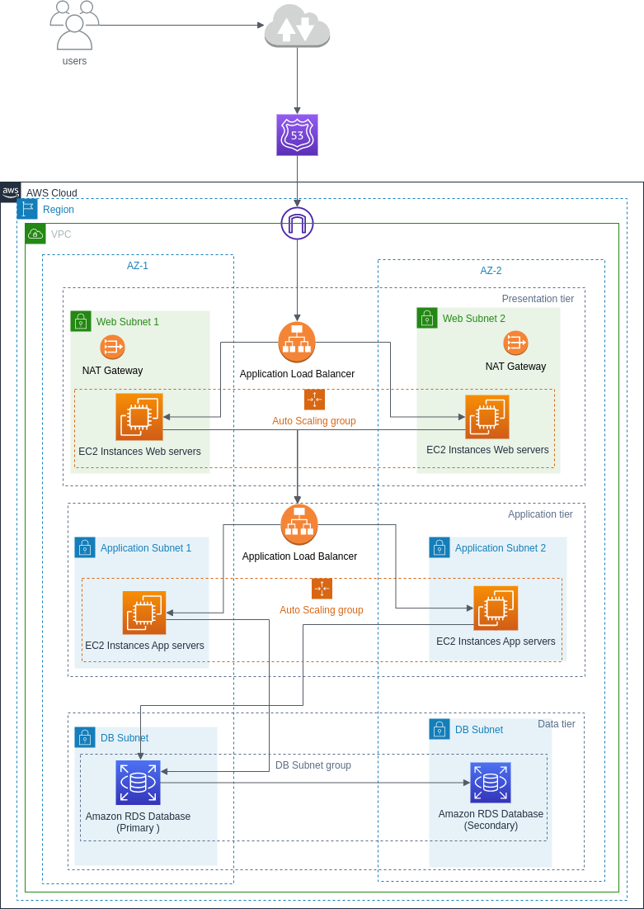

# 3tier-Architecture-in-AWS
Implemented a 3-tier Highly Available, Fault Tolerant and Secure AWS Web Architecture.
Blog link: https://mupreti.hashnode.dev/the-power-of-layers-our-three-tier-architecture-in-aws

# Note: 

-> The blog shows full implementation of 3-tier-application-architecture in AWS with features including fault tolerance, high availabilty, and security. 

-> Simple architectural diagram is here: 

